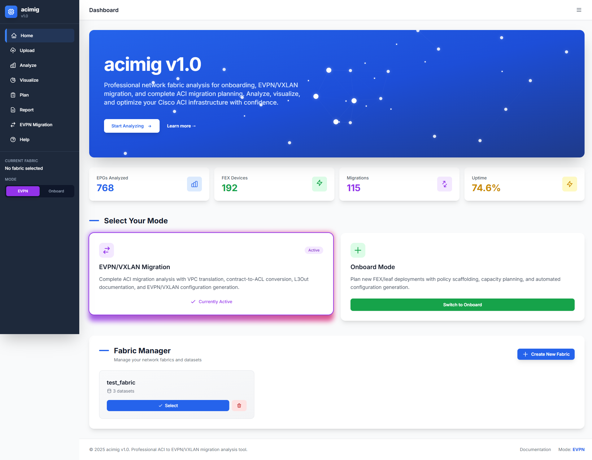
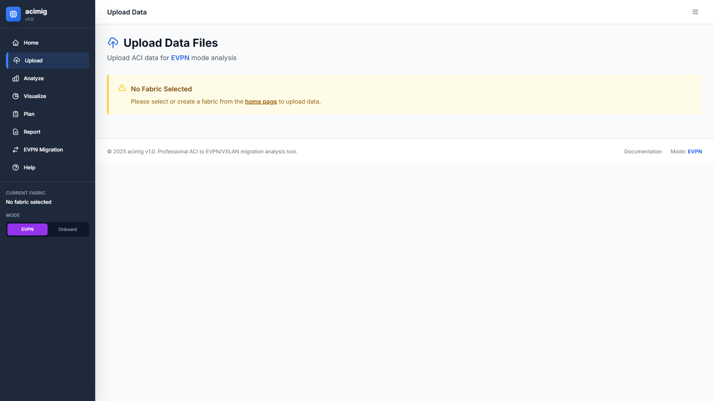
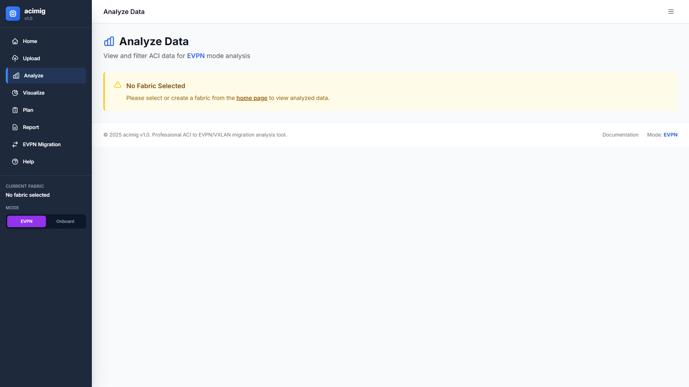
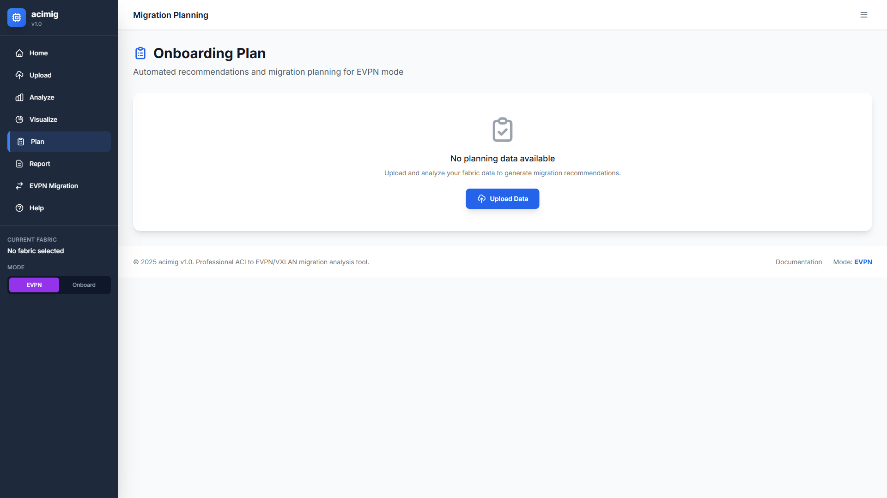
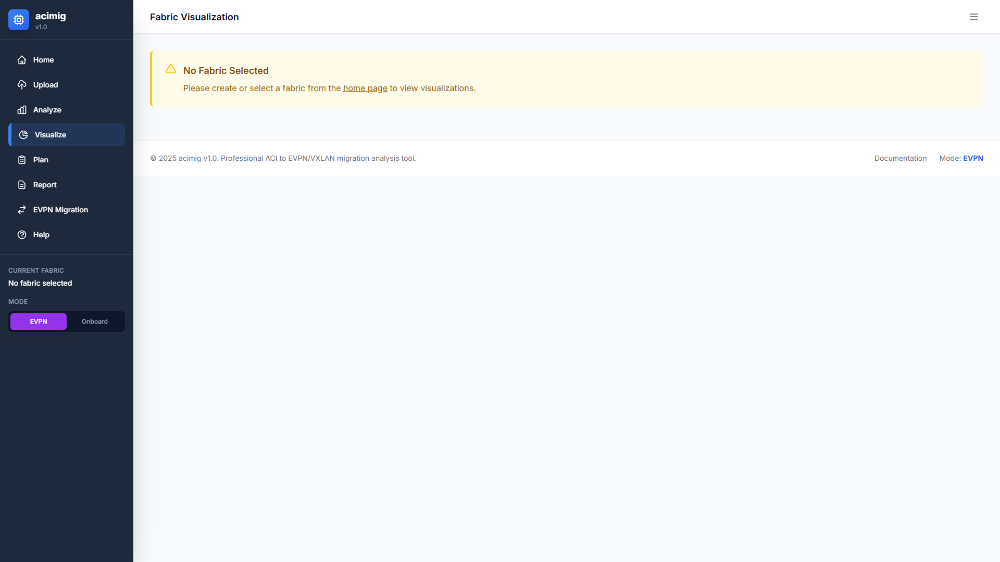
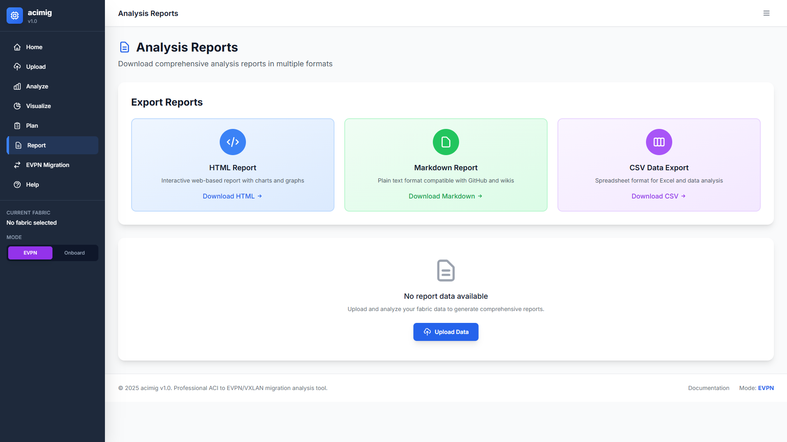

# ACI Migrator

> **Professional ACI to EVPN/VXLAN Migration Analysis Tool**

A comprehensive, web-based application for analyzing Cisco ACI fabrics and generating migration plans to standards-based EVPN/VXLAN architectures. Streamline your network infrastructure modernization with automated configuration generation, intelligent recommendations, and detailed analysis.

[](#)
[](https://www.python.org/)
[](https://flask.palletsprojects.com/)
[](#)

---

## Features

### Data Upload & Analysis
Upload ACI configuration data (JSON/XML), legacy configs (TXT/CFG), and CMDB data (CSV). The tool parses and categorizes network objects including FEX devices, leaf switches, EPGs, bridge domains, VRFs, contracts, subnets, and interfaces.

**Key Capabilities:**
- Multi-format data ingestion (ACI JSON/XML, legacy configs, CMDB CSV)
- Automatic object categorization and relationship mapping
- Data completeness validation
- Multi-fabric management support

### Migration Planning
Generate comprehensive migration recommendations based on your current ACI configuration. Analyze VPC configurations, contract-to-ACL translations, L3Out connectivity, and VLAN namespace management.

**Migration Analysis Includes:**
- VPC and port-channel configuration analysis
- Contract-to-ACL translation mapping
- L3Out and external connectivity documentation
- VLAN pool and namespace management
- Physical connectivity and interface policy analysis
- Migration readiness assessment with risk scoring

### Topology Visualization
Interactive network topology visualization with detailed device mapping, leaf-FEX relationships, EPG complexity analysis, and port utilization charts.

**Visualization Dashboards:**
- Interactive network topology graphs
- Leaf-FEX mapping and hierarchies
- Port utilization heatmaps
- VLAN distribution analysis
- EPG complexity scoring
- Migration readiness indicators

### EVPN/VXLAN Configuration Generation
Automatically generate standards-based EVPN/VXLAN configurations for multiple target platforms including Cisco NX-OS, Arista EOS, and Juniper Junos.

**Supported Platforms:**
- Cisco Nexus (NX-OS)
- Arista (EOS)
- Juniper (Junos)

**Generated Configurations:**
- Spine configurations (BGP route reflectors, EVPN address-family)
- Leaf configurations (VTEP, BGP neighbors, VNI/VLAN mappings)
- Border leaf configurations (L3Out equivalents, external BGP)

### Reports & Documentation
Export comprehensive analysis reports in multiple formats including HTML (interactive), Markdown (documentation), and CSV (data analysis).

**Report Types:**
- Executive summary with key metrics
- Detailed technical analysis
- Migration recommendations with priorities
- Risk assessment and mitigation strategies
- Configuration samples and templates

---

## Screenshots

### Dashboard with Sidebar Navigation
The new professional sidebar navigation provides quick access to all features with collapsible menu, integrated fabric manager, and mode toggle.


*Note: Screenshot pending. See `docs/screenshots/SCREENSHOT_GUIDE.md` for capture instructions.*

**Key Sidebar Features:**
- Quick navigation to all pages (Home, Upload, Analyze, Visualize, Plan, Report, Help)
- Integrated Fabric Manager (collapsible panel)
- Mode selector (EVPN/Onboard)
- Responsive design with mobile support

### Data Upload Interface
Drag-and-drop file upload with real-time progress tracking and multi-file queue management.


*Note: Screenshot pending.*

### Analysis Dashboard
Comprehensive data analysis with interactive tables, search filtering, and data completeness validation.


*Note: Screenshot pending.*

### Migration Planning
Automated recommendations with priority scoring, implementation steps, and risk assessments.


*Note: Screenshot pending.*

### Visualization Dashboard
Interactive charts and topology graphs for fabric analysis and capacity planning.


*Note: Screenshot pending.*

### Reports Export
Multi-format report generation (HTML, Markdown, CSV) for documentation and analysis.


*Note: Screenshot pending.*

---

## Quick Start

### Prerequisites
- **Python**: 3.8 or higher
- **pip**: Latest version
- **Operating System**: Windows, macOS, or Linux

### Installation

1. **Clone or download the repository:**
   ```bash
   git clone <repository-url>
   cd aciv2
   ```

2. **Install dependencies:**
   ```bash
   pip install -r requirements.txt
   ```

3. **Configure environment (optional):**
   ```bash
   cp .env.example .env
   # Edit .env to customize settings
   ```

4. **Start the application:**
   ```bash
   python app.py
   ```

5. **Access the web interface:**
   Open your browser to `http://127.0.0.1:5000`

### First Migration Analysis

1. **Create a fabric**
   - Open the sidebar (left side of screen)
   - Click "Fabric Manager" to expand the panel
   - Click "Create Fabric" button
   - Enter a fabric name (e.g., "production-dc1")
   - The new fabric will be automatically selected

2. **Upload ACI data**
   - Go to Upload page
   - Drag and drop your ACI JSON/XML files
   - Wait for parsing to complete
   - Files are stored in the currently selected fabric

3. **Analyze the data**
   - Navigate to Analyze page
   - Review data completeness validation
   - Explore categorized objects (FEX, Leafs, EPGs, etc.)
   - Use search and filters to focus on specific data

4. **Generate migration plan**
   - Go to Plan page
   - Review automated recommendations
   - Download configuration samples
   - Export EVPN configurations for target platforms

5. **Export reports**
   - Navigate to Reports page
   - Choose your format (HTML, Markdown, CSV)
   - Download comprehensive analysis

**Fabric Management:**
- **Switch Fabrics**: Use the dropdown in the Fabric Manager (sidebar)
- **Delete Fabric**: Click "Delete Fabric" button (requires confirmation)
- **View Current**: Current fabric name is always displayed in the sidebar

---

## Architecture & Design

### Application Structure

```
aciv2/
├── app.py                 # Main Flask application
├── config.py              # Configuration management
├── VERSION                # Version file (1.0.0)
├── requirements.txt       # Python dependencies
├── .env.example          # Environment template
│
├── analysis/             # Analysis engine modules
│   ├── engine.py         # Core ACI analyzer
│   ├── parsers.py        # Data parsers (JSON/XML/CSV)
│   ├── planning.py       # Migration planning engine
│   ├── reporting.py      # Report generation
│   ├── evpn_migration.py # EVPN config generator
│   └── fabric_manager.py # Multi-fabric management
│
├── templates/            # HTML templates (Jinja2)
│   ├── base.html         # Base template with sidebar
│   ├── index.html        # Dashboard/home page
│   ├── upload.html       # Data upload interface
│   ├── analyze.html      # Analysis dashboard
│   ├── visualize.html    # Visualization dashboard
│   ├── plan.html         # Migration planning
│   ├── report.html       # Reports page
│   └── help.html         # Documentation
│
├── static/               # Static assets
│   ├── app.js            # Core JavaScript
│   ├── upload.js         # Upload functionality
│   └── styles.css        # Custom styles
│
├── docs/                 # Documentation
│   └── screenshots/      # UI screenshots
│
├── fabrics/              # Fabric data storage
├── output/               # Generated reports/configs
└── tests/                # Test suite
```

### Technology Stack

**Backend:**
- Flask 3.0+ - Web framework
- Python 3.8+ - Core language
- WTForms - Form validation
- Flask-Limiter - Rate limiting

**Frontend:**
- Tailwind CSS - Utility-first CSS framework
- Vanilla JavaScript - No heavy frameworks
- Chart.js - Data visualization
- D3.js - Network topology graphs

**Analysis Engine:**
- Custom ACI parser - Handles JSON/XML formats
- Relationship mapper - Builds object dependencies
- Configuration generator - EVPN/VXLAN configs

**Security:**
- CSRF protection
- File upload validation
- Path traversal prevention
- Rate limiting
- Input sanitization

---

## Supported Data Formats

### ACI Data (JSON/XML)
Upload complete ACI configuration exports containing:
- Tenant configurations (EPGs, Bridge Domains, VRFs, Contracts)
- Fabric topology (Spines, Leafs, FEX devices)
- Interface policies and profiles
- Physical connectivity
- VLAN pools and encapsulation
- L3Out configurations

### Legacy Network Configs (TXT/CFG/CONF)
Parse legacy network device configurations from:
- Cisco IOS/NX-OS
- Cisco Catalyst switches
- Other Cisco platforms

Extracted data includes:
- Interface configurations
- VLAN assignments
- Routing configurations
- Access control lists

### CMDB Data (CSV)
Import CMDB/inventory data with fields:
- Device hostname/ID
- IP address
- Location/rack
- Device type/model
- Port assignments
- VLAN assignments
- Application/owner information

---

## Modes of Operation

### EVPN Migration Mode
Analyze ACI fabric and generate EVPN/VXLAN migration plans for standards-based architectures.

**Use Cases:**
- Migrating from ACI to EVPN/VXLAN
- Multi-vendor fabric deployments
- Cost reduction through vendor diversification
- Standards-based architecture adoption

**Outputs:**
- VPC to MLAG/vPC translation
- Contract to ACL mapping
- EVPN configurations (spine, leaf, border leaf)
- Migration runbooks
- Risk assessments

### Onboard Mode
Plan new FEX/leaf deployments with policy scaffolding and capacity planning.

**Use Cases:**
- Expanding existing ACI fabric
- Planning new data center deployment
- Capacity planning and forecasting
- Policy template generation

**Outputs:**
- Capacity recommendations
- Policy scaffolding
- Configuration templates
- Deployment checklists

---

## Configuration

### Environment Variables

Create a `.env` file (copy from `.env.example`):

```bash
# Flask Configuration
FLASK_ENV=development
SECRET_KEY=your-secret-key-here

# Data Directories
DATA_DIR=./data
FABRICS_DIR=./fabrics
OUTPUT_DIR=./output

# Security
MAX_CONTENT_LENGTH=1073741824  # 1GB
ALLOWED_EXTENSIONS=json,xml,csv,txt,cfg,conf

# Rate Limiting
API_RATE_LIMIT=100 per hour

# Logging
LOG_LEVEL=INFO
LOG_FILE=./logs/app.log
```

### Directory Structure

The application automatically creates these directories:
- `data/` - Temporary data storage
- `fabrics/` - Multi-fabric persistent storage
- `output/` - Generated reports and configurations
- `logs/` - Application logs

---

## Advanced Usage

### Multi-Fabric Management

Work with multiple fabrics simultaneously using the integrated Fabric Manager in the sidebar:

1. **Create Multiple Fabrics**: Click "Create Fabric" in the sidebar Fabric Manager
2. **Switch Between Fabrics**: Use the dropdown selector in the Fabric Manager panel
3. **Organize by Environment**: Create separate fabrics for prod, dev, staging
4. **Delete Old Fabrics**: Use the "Delete Fabric" button with confirmation
5. **View Current Context**: The sidebar always shows your current fabric

**Fabric Manager Location**: The Fabric Manager is now integrated into the left sidebar for easy access from any page. Simply click "Fabric Manager" to expand/collapse the panel.

### Custom Analysis

Extend the analysis engine with custom metrics:

```python
from analysis.engine import ACIAnalyzer

# Load fabric data
analyzer = ACIAnalyzer(fabric_data)

# Run custom analysis
custom_metrics = analyzer.analyze_custom_metric()
```

### Batch Processing

Process multiple fabrics in batch mode:

```python
from analysis.fabric_manager import FabricManager

fm = FabricManager(fabrics_dir)
fabrics = fm.list_fabrics()

for fabric in fabrics:
    fabric_data = fm.get_fabric_data(fabric['name'])
    # Process fabric...
```

---

## API Reference

### Health Check
```
GET /health
```

Returns application health status and version:
```json
{
  "status": "healthy",
  "timestamp": "2025-11-13T10:00:00",
  "version": "1.0.0",
  "app_name": "ACI Migrator"
}
```

### Fabric Management
```
GET    /fabrics                 # List all fabrics
POST   /fabrics                 # Create new fabric
DELETE /fabrics/<name>          # Delete fabric
POST   /fabrics/<name>/select   # Select fabric
```

### Data Upload
```
POST   /upload                  # Upload data file
```

### Analysis APIs
```
GET /api/analyze/vpc/<fabric_id>        # VPC analysis
GET /api/analyze/contracts/<fabric_id>  # Contract analysis
GET /api/analyze/l3out/<fabric_id>      # L3Out analysis
GET /api/analyze/vlans/<fabric_id>      # VLAN analysis
GET /api/analyze/physical/<fabric_id>   # Physical connectivity
GET /api/migration-assessment/<fabric_id> # Full assessment
```

### Reports
```
GET /download/report/<format>           # Download report (html/markdown/csv)
GET /download/evpn_config/<device_role> # Download EVPN config
```

---

## Troubleshooting

### Common Issues

**Issue: Application won't start**
```bash
# Check Python version (3.8+ required)
python --version

# Reinstall dependencies
pip install --upgrade -r requirements.txt

# Check for port conflicts
netstat -an | grep 5000
```

**Issue: File upload fails**
```bash
# Check file size (max 1GB default)
# Check file extension (allowed: json, xml, csv, txt, cfg, conf)
# Check logs for details
tail -f logs/app.log
```

**Issue: Parse errors**
```bash
# Validate JSON/XML format
# Check for BOM or encoding issues
# Try different file encoding (UTF-8, Latin-1)
```

### Debug Mode

Enable debug logging:
```bash
export FLASK_ENV=development
export LOG_LEVEL=DEBUG
python app.py
```

### Reset Application

Clear all data and start fresh:
```bash
# Backup first!
cp -r fabrics fabrics.backup

# Remove all data
rm -rf fabrics/* output/* logs/*

# Restart application
python app.py
```

---

## Security Considerations

### Data Privacy
- **Local-only**: All data processing happens locally
- **No cloud**: No data sent to external services
- **File-based**: Easy to audit and backup
- **No database**: No SQL injection risks

### File Upload Security
- Extension validation
- Content-type checking
- Path traversal prevention
- File size limits
- CSRF protection

### Best Practices
1. Run on trusted networks only
2. Use HTTPS in production (configure reverse proxy)
3. Regularly backup fabric data
4. Review logs for suspicious activity
5. Keep dependencies updated

---

## Performance

### Tested Scale
- **Fabrics**: 20+ simultaneous fabrics
- **Devices**: 110+ leaf switches, 316+ FEX devices
- **Objects**: 1000+ EPGs, 500+ bridge domains
- **Data**: 1GB+ configuration files

### Optimization Tips
1. Use data pagination for large tables (built-in)
2. Limit visualization to relevant subsets
3. Generate reports asynchronously for large datasets
4. Use CSV export for offline analysis of large data

---

## Development

### Running Tests

```bash
# Run all tests
python -m pytest

# Run specific test file
python test_analysis_engine.py

# Run with coverage
python -m pytest --cov=analysis
```

### Code Style

```bash
# Format code
black app.py analysis/

# Lint code
flake8 app.py analysis/

# Type checking
mypy app.py
```

### Contributing

1. Fork the repository
2. Create a feature branch
3. Make your changes
4. Add tests for new functionality
5. Ensure all tests pass
6. Submit a pull request

---

## Changelog

### Version 1.0.0 (2025-11-13)
- Complete UI overhaul with professional sidebar navigation
- Rebranded to "ACI Migrator v1.0"
- Added comprehensive animations throughout the UI
- Improved mobile responsiveness
- Enhanced data visualization dashboards
- Added version management with VERSION file
- Comprehensive documentation update
- Screenshot guide for UI documentation

### Previous Versions
See `IMPLEMENTATION_SUMMARY.md` for detailed development history.

---

## License

Internal use only. Not for distribution.

---

## Support

### Documentation
- In-app help: Click "Help" in the sidebar
- Screenshot guide: `docs/screenshots/SCREENSHOT_GUIDE.md`
- Implementation details: `IMPLEMENTATION_SUMMARY.md`

### Feedback
For issues, feature requests, or questions, please contact the development team.

---

## Acknowledgments

Built with:
- Flask - Web framework
- Tailwind CSS - UI framework
- Chart.js & D3.js - Visualizations
- Python ecosystem - Analysis engine

---

**ACI Migrator v1.01** - Professional ACI to EVPN/VXLAN Migration Analysis Tool
